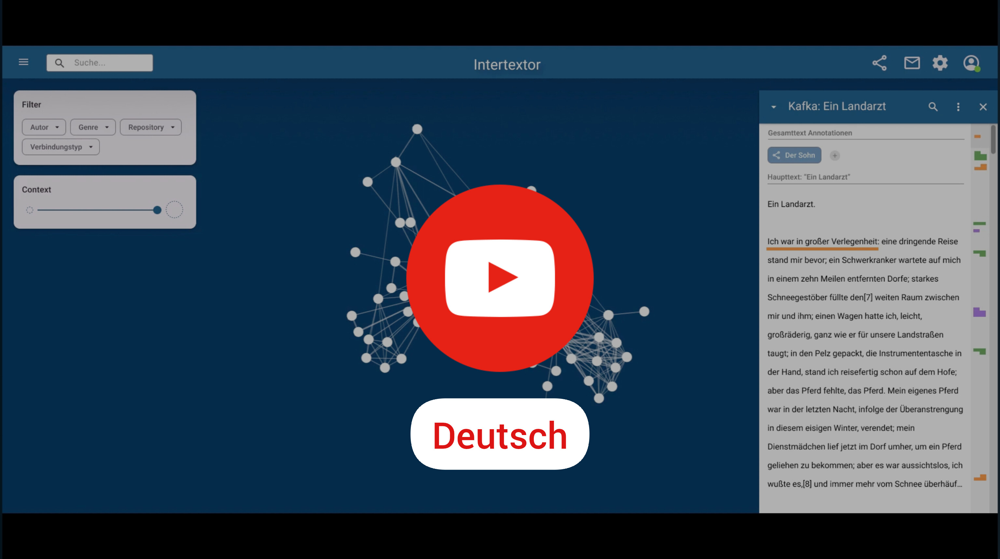

# Poster abstract

> Das Poster stellt den Entwurf eines neuen Werkzeugs zur manuellen Erfassung und Erforschung von Intertextualität als Netzwerk vor. Dabei schließt es an umfangreiche Vorarbeiten an, in deren Zug verschieden ausgeprägte Intertextualitätstheorien auf ihren gemeinsamen konzeptionellen Kern hin untersucht und formalisiert worden sind. Diese Formalisierung und Modellierung wurde auf der DHd 2023 präsentiert. Das Poster gewährt einen Einblick, wie auf dieser Grundlage fortschreitend Aspekte der Visualisierung und User-Experience bei der Toolentwicklung berücksichtigt werden. Im Zentrum stehen Überlegungen zu 4 verschiedenen Zoomstufen von Texten, die zur Visualisierung von Intertextualität als Netzwerk auf unterschiedliche Weise miteinander kombiniert werden können. Diese Kombinationen ermöglichen jeweils andere praxeologische wie methodische Zugänge zu Intertextualität: von strukturalen bis zum detaillierten Close-Reading, vom globalen Netzwerk bis zur synoptischen Parallelisierung einzelner Texte. Das Poster lädt die Community ein, sich am Tool zu beteiligen, sei es bei der Formulierung von Anforderung oder bei der technischen Entwicklung.

## Video demonstrations

 &nbsp;&nbsp;&nbsp; 
